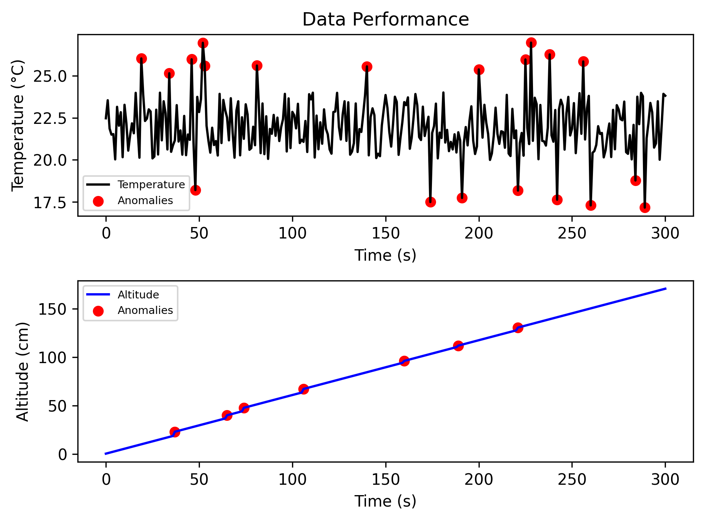

# BMP180-Sensor-Simulation-Analysis
A Python-based diagnostic pipeline and digital twin for barometric sensor telemetry, featuring state-tracking anomaly detection and automated reporting.
# Visualization 

  

